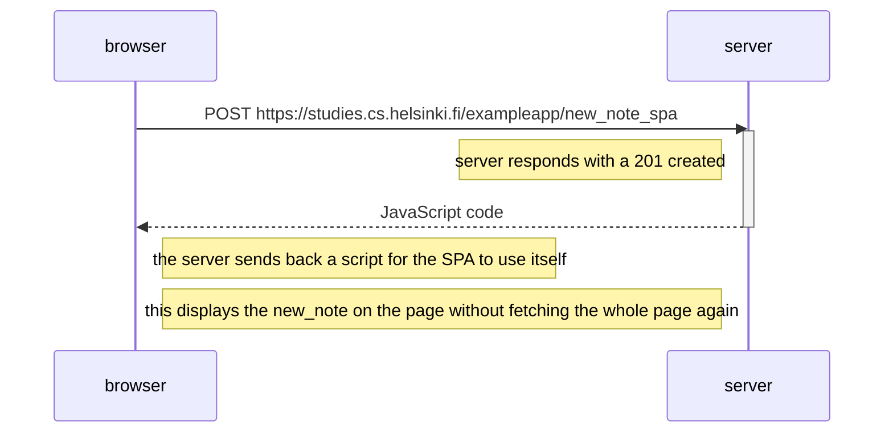

```mermaid
sequenceDiagram
    participant browser
    participant server

    browser->>server: POST https://studies.cs.helsinki.fi/exampleapp/new_note_spa
    activate server
    note left of server: server responds with a 201 created
    server-->>browser: JavaScript code
    deactivate server

    note right of browser: the server sends back a script for the SPA to use itself
    note right of browser: this displays the new_note on the page without fetching the whole page again
```
